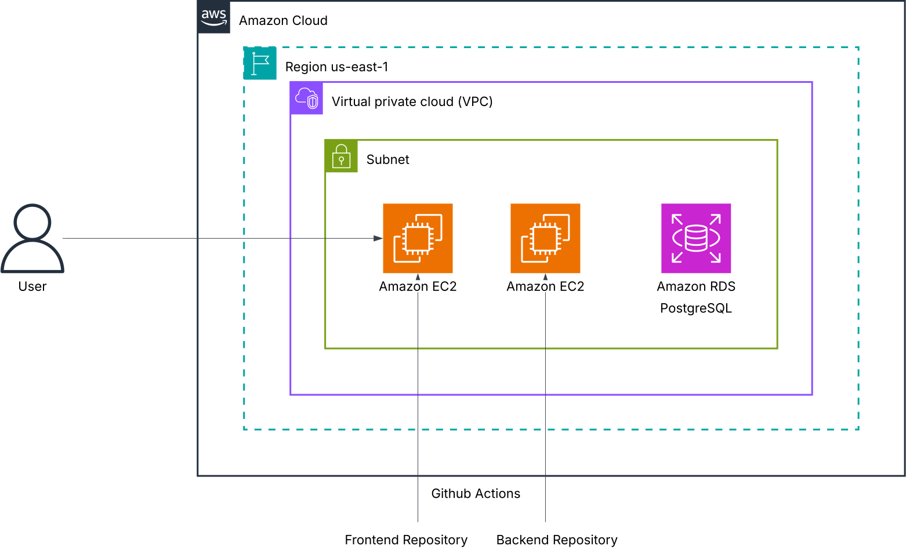

# Technical Document

This document provides a detailed technical overview of the **Inventory Management System (IMS)**.  
It focuses on the internal working of the system, explaining how data flows, how it is structured, and how different components interact with each other to achieve system functionality.

---

## Data Flow

### Overview

The **Data Flow Diagram (DFD)** of the **Inventory Management System (IMS)** illustrates the logical movement of data among the primary entities, system processes, and the centralized database.  

The flow begins with a **User** initiating authentication through the **JWT-based Authentication Module**, where login credentials are validated against stored user records. Upon successful verification, access privileges are assigned based on the user’s designated role.

- A **Manager (Authenticated)** can update product details, manage inventory levels, and view all recorded sales transactions for monitoring purposes.  
- A **Salesperson (Authenticated)** can record new sales transactions and view their individual transaction history.  

Both roles interact with system processes that communicate directly with the **Database**, which acts as the central data repository.  

---

### Data Flow Diagram

{ width="110%" style="display:block; margin-left:auto; margin-right:auto;"}

---

### Flow Description

#### User Authentication
All users initiate interaction with the system through a secure login process. Upon submission of credentials, the **Authentication Module** verifies user details against the **User Database**. If valid, a **JWT token** is generated and issued to the client, allowing authenticated access to authorized system functions.

#### Manager’s Operations
After successful authentication, the **Manager** gains access to product and transaction management features.  
They are permitted to:   

- **Update inventory**, including adding, modifying, or deleting product details.  
- **View transaction records** for oversight of sales activities.  

All modifications performed by the manager are securely stored in the central **Database**, ensuring real-time data consistency.

#### Salesperson’s Operations
Once authenticated, the **Salesperson** can:  

- **Record sales transactions**, selecting products and quantities from available stock.  
- **View their own transaction history**, allowing transparency and tracking of sales activity.  

Each transaction entry updates the **Transactions** and **Products** tables in the **Database**, reflecting accurate stock levels after every sale.

#### Database Interactions
The **Database** serves as the unified data repository for all system entities, including **Users**, **Products**, and **Transactions**.  
Every process communicates with the database through secure API calls.
---

##  Data Modeling

The **Data Model** of the **Inventory Management System (IMS)** represents the logical organization of data across the system’s core entities.  

{ width="150%" style="display:block; margin-left:auto; margin-right:auto;"}

### Schema Description

#### **1. USERS Table**
The `USERS` table stores information about all registered system users, including Admins, Managers, and Salespersons.  
It serves as the authentication backbone of the system and enforces role-based access through the `role` attribute.

| Field | Type | Description |
|:------|:------|:------------|
| `id` | int (PK) | Unique identifier for each user. |
| `username` | varchar | Login name used for authentication. |
| `role` | enum | Specifies user type — *Admin*, *Manager*, or *Salesperson*. |
| `password` | varchar | Encrypted password for secure authentication. |
| `first_name`, `last_name` | varchar | Personal details of the user. |
| `created_at`, `updated_at`, `deleted_at` | datetime | Track record lifecycle and soft deletion. |

##### **Relationships:**  
- A user **makes** one or more transactions (`user_id` → `TRANSACTIONS.id`).  
- A user’s permissions depend on their assigned role.

---

#### **2. PRODUCTS Table**
The `PRODUCTS` table manages all inventory-related data.  
It stores product-specific attributes such as category, quantity, and price.  
This table is primarily updated by Admins and Managers, ensuring inventory accuracy.

| Field | Type | Description |
|:------|:------|:------------|
| `id` | int (PK) | Unique product identifier. |
| `product_name` | varchar | Name of the product. |
| `category` | enum | Classification of the product (e.g., Electronics, Apparel, etc.). |
| `quantity` | int | Current stock count for the product. |
| `price` | numeric | Price per unit of the product. |
| `created_at`, `updated_at`, `deleted_at` | datetime | Audit timestamps for record management. |

##### **Relationships:**  
- A product can appear in multiple transactions through the `TRANSACTION_PRODUCTS` table.  
- Linked to `TRANSACTION_PRODUCTS` via `product_id`.

---

#### **3. TRANSACTIONS Table**
The `TRANSACTIONS` table records each sale or purchase event performed within the system.  
Each transaction is linked to the user who initiated it and may contain multiple product entries.

| Field | Type | Description |
|:------|:------|:------------|
| `id` | int (PK) | Unique identifier for the transaction. |
| `transaction_type` | enum | Indicates whether the transaction is a *Sale* or *Purchase*. |
| `user_id` | int (FK) | References the user who performed the transaction. |
| `grand_total` | numeric | Total monetary value of the transaction. |
| `created_at`, `updated_at`, `deleted_at` | datetime | Lifecycle tracking of transaction records. |

##### **Relationships:**  
- A transaction **contains** one or more product entries recorded in the `TRANSACTION_PRODUCTS` table.  
- A transaction is **made by** a user (`user_id` foreign key).

---

#### **4. TRANSACTION_PRODUCTS Table**
The `TRANSACTION_PRODUCTS` table acts as a junction table connecting `TRANSACTIONS` and `PRODUCTS`.  
It maintains a record of all individual product entries associated with a specific transaction.

| Field | Type | Description |
|:------|:------|:------------|
| `id` | int (PK) | Unique identifier for the record. |
| `transaction_id` | int (FK) | References the transaction to which the product belongs. |
| `product_id` | int (FK) | References the product involved in the transaction. |
| `quantity` | int | Number of units of the product in this transaction. |
| `subtotal` | numeric | Total cost for the given quantity of that product. |
| `created_at`, `updated_at`, `deleted_at` | datetime | Record management and auditing fields. |

##### **Relationships:**  
- **Many-to-Many** link between `TRANSACTIONS` and `PRODUCTS`.  
- Each entry represents one product line item within a transaction.

---

## 3. System Architecture

This section presents the overall system architecture, describing the key components and how they interact.

{ width="100%" style="display:block; margin-left:auto; margin-right:auto;"}

---

## Authentication

The **Inventory Management System (IMS)** uses **JWT (JSON Web Token)**–based authentication, implemented through the **Django REST Framework Simple JWT** library.  
This enables stateless and secure communication between the client and server, ensuring controlled access for each authorized role — **Admin**, **Manager**, and **Salesperson**.

---

### Authentication Process Overview

1. A user (Admin, Manager, or Salesperson) enters their **username** and **password** on the login screen.  
2. The frontend sends these credentials to the backend authentication endpoint (`/api/auth/login/`).  
3. The backend validates the credentials against the **Users** table.  
4. If valid, the backend generates both an **Access Token** (short-lived) and a **Refresh Token** (long-lived) using **Simple JWT**.  
5. These tokens are returned to the frontend and securely stored in the local storage.
6. When the access token expires, the frontend uses the refresh token at `/api/auth/refresh/` to obtain a new one.  
7. If credentials are invalid, the system responds with **HTTP 401 Unauthorized**.

This JWT-based flow ensures **secure, stateless session handling** and enforces **role-based authorization**, where each user can only access functionalities permitted for their role.

## Authorization

**Authorization** in the **Inventory Management System (IMS)** ensures that only authenticated users can access specific system functionalities according to their assigned roles.  
It enforces **role-based access control (RBAC)**, maintaining data integrity, operational hierarchy, and system security.

After successful authentication, each user’s JWT token carries an embedded **role claim** (Admin, Manager, or Salesperson), which the backend verifies before granting access to protected resources or endpoints.  
This mechanism ensures that every API request is validated against both the user’s identity and their authorized permissions.

---

### Role-Based Access Overview

#### **1. Admin**
- **Can:**  
  - Add, edit, or delete products.  
  - Update inventory levels.  
  - Record purchase or sale transactions.  
  - View all transactions in the system.  
  - Manage user accounts.  
- **Cannot:**  
  - Perform any action without valid authentication.

#### **2. Manager**
- **Can:**  
  - Add or delete products.  
  - Update inventory data.  
  - View and monitor all sales transactions performed by salespersons.  
- **Cannot:**  
  - Access user management features.  
  - Record sales or purchase transactions directly.

#### **3. Salesperson**
- **Can:**  
  - View available products and quantities.  
  - Record new sales transactions.  
  - View their own transaction history.  
- **Cannot:**  
  - Modify or delete products.  
  - Access transactions recorded by other users.  
  - Perform administrative or managerial tasks.

---

This structured authorization model ensures **clear role separation**, **minimal privilege access**, and **secure control over business operations**.  
By combining JWT authentication with role-based authorization, the IMS maintains a secure and well-defined operational workflow across all system components.

## **Tech Stack**

### **1. Frontend**

| Component | Technology Used | Stable Version | Description |
|------------|------------------|----------------|--------------|
| **Markup & Styling** | HTML5, CSS3 | Latest | Used to create a responsive and accessible user interface. |
| **Scripting** | JavaScript  | ES6+ | Handles API integration, form validation, and user interactions. |
| **Design Framework** | Bootstrap | 5.x | Optional use for layout, grid, and responsive design. |
| **PWA Support** | Web App Manifest, Service Worker | — | Enables offline functionality and mobile compatibility. |

### **2. Backend**

| Component | Technology Used | Stable Version | Description |
|------------|------------------|----------------|--------------|
| **Framework** | Django REST Framework (DRF) | 3.16 | Handles APIs, authentication, and business logic. |
| **Language** | Python | 3.13.7 | Backend development language for logic and integration. |
| **Authentication** | Simple JWT (DRF) | 5.5.1| Provides stateless user authentication via JWT tokens. |
| **Database** | PostgreSQL | 16 | Stores structured data with relational integrity. |
| **ORM** | Django ORM | Included | Simplifies database queries and migrations. |

### **3. Tools & Technologies**

| **Component** | **Technology Used** | **Stable Version** | **Description** |
|----------------|----------------------|--------------------|------------------|
| **Version Control** | Git + GitHub | Latest | Used for source code management and collaboration. |
| **CI/CD Pipeline** | GitHub Actions | Latest | Automates build, testing, and deployment workflows. |
| **Package Management** | pip | 25.2 | Handles dependency installation and environment management. |
| **IDE / Code Editor** | VS Code | Latest | Development environment for writing and debugging code. |
| **API Testing Tool** | Postman | Latest | Used for testing, validating, and documenting RESTful APIs. |
| **Backend Testing Framework** | Pytest | 8.3 | Framework for unit, integration, and functional testing of Django backend. |
| **Frontend Testing Framework** | Jest | 29.7 | JavaScript testing framework used for testing UI components and frontend logic. |

