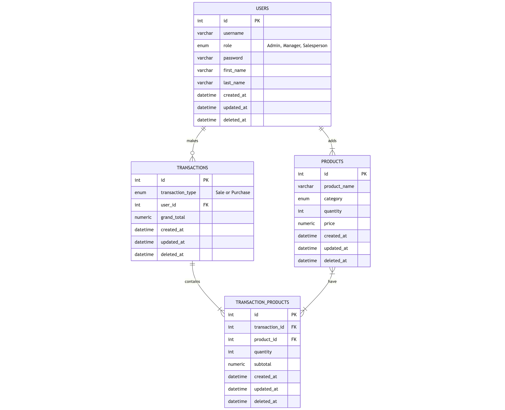

# 🧩 Technical Document

This document provides a detailed technical overview of the **Inventory Management System (IMS)**.  
It focuses on the internal working of the system, explaining how data flows, how it is structured, and how different components interact with each other to achieve system functionality.

---

## Data Flow

### Overview

The **Data Flow Diagram (DFD)** of the **Inventory Management System (IMS)** illustrates the logical movement of data among the primary entities, system processes, and the centralized database.  

The flow begins with a **User** initiating authentication through the **JWT-based Authentication Module**, where login credentials are validated against stored user records. Upon successful verification, access privileges are assigned based on the user’s designated role.

- A **Manager (Authenticated)** can update product details, manage inventory levels, and view all recorded sales transactions for monitoring purposes.  
- A **Salesperson (Authenticated)** can record new sales transactions and view their individual transaction history.  

Both roles interact with system processes that communicate directly with the **Database**, which acts as the central data repository.  

---

### Data Flow Diagram

{ width="110%" style="display:block; margin-left:auto; margin-right:auto;"}

---

### Flow Description

#### User Authentication
All users initiate interaction with the system through a secure login process. Upon submission of credentials, the **Authentication Module** verifies user details against the **User Database**. If valid, a **JWT token** is generated and issued to the client, allowing authenticated access to authorized system functions.

#### Manager’s Operations
After successful authentication, the **Manager** gains access to product and transaction management features.  
They are permitted to:    
- **Update inventory**, including adding, modifying, or deleting product details.  
- **View transaction records** for oversight of sales activities.  

All modifications performed by the manager are securely stored in the central **Database**, ensuring real-time data consistency.

#### Salesperson’s Operations
Once authenticated, the **Salesperson** can:   
- **Record sales transactions**, selecting products and quantities from available stock.  
- **View their own transaction history**, allowing transparency and tracking of sales activity.  

Each transaction entry updates the **Transactions** and **Products** tables in the **Database**, reflecting accurate stock levels after every sale.

#### Database Interactions
The **Database** serves as the unified data repository for all system entities, including **Users**, **Products**, and **Transactions**.  
Every process communicates with the database through secure API calls.
---

## 2. Data Modeling

This section explains the logical structure of the database using an **Entity-Relationship (ER)** or **Schema Diagram**.  
It defines how different entities such as users, products, and transactions are related and how data is stored and retrieved efficiently.

{ width="150%" style="display:block; margin-left:auto; margin-right:auto;"}

---

## 3. System Architecture

This section presents the overall system architecture, describing the key components and how they interact.  
The system follows a layered architecture to ensure modularity, scalability, and maintainability — typically including the **Presentation Layer**, **Application Layer**, and **Data Layer**.

{ width="100%" style="display:block; margin-left:auto; margin-right:auto;"}

---

## 4. Technology Stack

| Layer | Technology Used |
|-------|-----------------|
| **Frontend** | HTML, CSS, JavaScript (or React) |
| **Backend** | Django REST Framework (DRF) |
| **Database** | PostgreSQL |
| **Authentication** | JSON Web Token (JWT) |
| **Version Control** | Git & GitHub |
| **Deployment (optional)** | Docker / AWS / Heroku |

---
